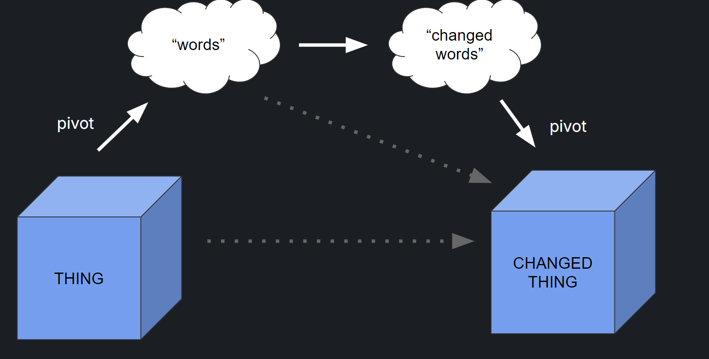

[](https://githubnext.com/)

# Extract, Edit, Apply

**GitHub Next Technical Report GHN-TR-1002**

**Abstract**: Extract, Edit, Apply (EEA) is a new category of assists for software development that aims to streamline the process of using natural language for code modification over existing codebases. EEA revolves around the notion of _ephemeral_, _editable_ specifications: users can edit either the code, or edit ephemeral specs, which are code summaries pivoting on a user-specifiable topic. The ephemeral specifications can be generated, modified, and discarded as needed. This report outlines the core idea, two of our prototypes of the concept, some observations of its utility, and describe possible future variations which could be developed.

Authors: Don Syme, Edward Aftandilian, , ... at [GitHub Next](https://githubnext.com/).

Bibtex:

```bib
@techreport{syme2024eea,
     title = {{Extract, Edit, Apply}},
     author = {Don Syme and Edward Aftandilian and Jonathan Carter and ...},
     group = {GitHub Next},
     number = {GHN-TR-1002},
     year = {2025},
     url = {https://github.com/githubnext/eea/blob/main/docs/report.md},
     institution = {GitHub},
     month = {03}
}
```

Image:



## Background

One of the core problems in software development is modifying existing codebases, particularly when working with large, complex systems where understanding the code and its specifications can be challenging.

In existing software development, it is often the case that "Code is King" - the code is the primary artifact, and any specifications or documentation are secondary, or even non-existent. While the role of specifications varies across different software development paradigms and settings, the general trend in the 2010s has been towards code being the primary artifact, with specifications at best secondary.

The advent of Generative AI has seen a rise in exploring ways to use the power of natural language within the software development process, opening possibilities of new paradigms in software development where tasks, specifications and requirements are primary - or at least first-class - citizens in the development process. One early example of this was [the SpecLang project](https://githubnext.com/projects/speclang/), developed by GitHub Next in 2023. SpecLang was envisaged as a specification compiler that allows users to describe the behavior of code in natural language, aiming to provide a way for developers to write specifications that are easy to understand and maintain, while also being machine-readable. While SpecLang was not publicly released it forms part of the background to the work described in this report.

Other examples of specification-first programming include:

- Adhoc use of code comments to prompt completion systems such as GitHub Copilot Completions.
- Adhoc use of Chat-GPT to generate code under human direction.
- The coding systems developed by [tessl.ai](https://tessl.ai/).
- The requirements-to-app toolchain of [cogna.co](https://cogna.co/).
- The app-description-to-code toolchain of [Lovable](https://www.lovable.dev/).
- The many recent examples of ["Vibe" programming](https://en.wikipedia.org/wiki/Vibe_coding).

There are, however, multiple problems with natural language "programming" where words, specifications or documentation are primary. These include:

- The initial absence of specifications or documentation in many existing codebases.
- The inherent ambiguity of language.
- The difficulty of understanding and maintaining natural language specifications.
- The non-deterministic nature of LLMs including code generation, even when intent is unambiguous.
- The instability of AI code-generation under otherwise small or unimportant changes to inputs.

Together these mean that Generative AI tends to be used in the "initial generation" mode, where the user asks for code, and the AI generates a new function, module, feature change or entire codebase. While this is immensely powerful, it begs the question "what next", and doesn't give a stable iterative workflow for assisted software development. Most notably, repeated applications of this methodology with slightly changed specifications can lead to wildly different outputs.

In practice, numerous techniques are utilized to "stabilize" the AI code generation process from an initial specification. These include:

- Using training and prompting techniques to reduce the valid space of generation, e.g. to constrain generation to a specific programming language, with specific conventions.
- Using retrieval techniques to constrain the kinds of code that can be generated, e.g. by using a large codebase as a "context" for the generation, or by having retrieval operate over the documentation for preferred libraries, design systems or functions.
- Using caching of generated code artifacts, so that, as the user iterates on a specification, the generative system refers to previous outputs and tries to keep the next iteration of outputs stable and consistent.

These techniques are all useful, but the problems of instability and ambiguity are endemic to human-iterative AI-generative workflows. These problems must always be navigated in some form by designers of natural-language coding tools, because the user will always want to iterate on the words they use to describe their intent: iterating on words is one of the most essential aspects of human creativity. This is true even when the user is not using natural language, but rather a formal specification language or strict specification methodology.

One approach to this is to switch to a "task-oriented" mode of describing changes to software, and this approach is now becoming normal, for example:

- Copilot Workspace, which allows users to describe tasks in natural language and then generates code to implement those tasks, and then allows further iterative changes to the code by imperative commands.
- Cursor Compose, which operates similarly in an IDE context.
- VSCode Edits, which is again similar and IDE-based.
- GitHub Spark, which accepts iterative updates to change a generated app.

However, another more human problem arises with task-oriented natural language programming: at each task description the user must "find" the words, the vocabulary, the concepts by which to describe the change they intend. Often the user has no idea how to do this. This problem has been known for many years in information retrieval, referred to as [the "vocabulary problem"](https://dl.acm.org/doi/10.1145/32206.32212). The vocabulary problem arises because the user must find the right words to describe their intent, and this can be difficult, especially when the user is not familiar with the codebase or the domain. Further the words chosen by the user may not be the same as the words used in the codebase. Another recurring problem is the "reference problem" - words must be found to refer to exact code locations and entities in code sufficiently unambiguously. In code this can mean finding natural language to refer to subtle points in the flow of information or control, or to specific data structures or algorithms. In order to change an information flow, it can first be necessary to summarize the whole flow, and then describe exactly how it is to change. This is tedious in natural language.

To summarize the situation: the advent of Generative AI means humans are now finding it compelling and productive to describe software changes with words. However words are ambiguous, the artifacts generated from them are unstable, and human often struggles to find the right words to describe intent sufficiently unambiguously.

## Core Idea

The above discussion assumes words are primary. However what if we start from the opposite position: what if code is primary, and specifications (words) are secondary, while still embracing natural language as a valid way of describing change? This is the starting point of the Extract, Edit, Apply (EEA) concept we have been exploring at GitHub Next.

EEA revolves around the notion of _ephemeral_, _editable_, _partial_ specifications. The paradigm is to make code permanent and specifications ephemeral: users can edit either the code or ephemeral specs, which are essentially code summaries that can be generated, modified, and discarded as needed. If the user edits an ephemeral specification, the toolchain will offer a code change corresponding to the spec change. The user can then accept or reject the code change, and the toolchain will apply the change to the codebase.

When extracting the specification, the extraction is done with respect to a "pivot" or "topic" - a phrase, words or text that is used as a reference for the extraction. This pivot can be anything, but in practice we have explored many kinds of pivots, some of which we will catalogue in the subsequent sections.


## Formulation as Functions

Let's contrast the essential components of spec-first and code-first natural language programming. For a spec-first approach, we have:

- `State`: Spec
- `CompileSpec`: Spec ⟿ Code

If the spec-first approach supports iterating on the specification and code, we also have:

- `StartState`: (Spec, Code)
- `EditSpec`: Spec ⟿ Spec' (done by human)
- `ApplyPartialSpecChange`: (Code, Spec, Spec') ⟿ Code'
- `EndState`: (Spec', Code')

In the above the symbol ⟿ represents an unstable generation of words or code either by a human or using one or more LLM invocations, where the instability can arise from any of the reasons well-associated with LLM probabilistic generation: the inherent ambiguity of words, the many possible ways to code a solution, the "filling in of reasonable defaults" that happens when LLMs elaborate specifications, or the process of hallucination over ambiguous problems spaces. These functions can be autonomous agentic processes that have any internal iteration or processing logic.

In contrast, a code-first approach with EEA has the following components:

- `StartState`: Code
- `ExtractPartialSpec`: Code + Pivot ⟿ PartialSpec
- `EditPartialSpec`: PartialSpec ⟿ PartialSpec' (done by human)
- `ApplyPartialSpecChange`: (Code, Pivot, PartialSpec, PartialSpec') ⟿ Code'
- `EndState`: Code'

Note also that the `ExtractPartialSpec` function is not a simple "summarization" function. It is a complex function that can involve multiple steps, including retrieval of relevant code, summarization, and generation of a specification. Further the output need not be plain text or markdown: it can int theory be a diagram generator, or property extractor, or entity extractor, or a myriad of other analysis operations over code.

The inputs to the `ApplyPartialSpecChange` function include both the original and modified partial specifications. This function will typically be implemented by an LLM, and in its prompt-preparation the change being requested can be assessed and emphasized ("the developer has added a new requirement" or "the developer has adjusted X to Y" etc.). Further, the entire context of the original analysis is known to the function, and so the LLM processing can be designed to apply the change in a way that is consistent with the original analysis.

Note that in the purist, dogmatic form of EEA, no code editing by the human is needed at all - in theory all coding can proceed via repeated specification extraction, editing and application. However, in practice, the human will often need to edit the code directly, and this is compatible with EEA.

## Many Pivots, Many Specifications

EEA embraces the idea that there is not one "primary" specification, but rather many possible "partial" specifications that can be used to give valid "views" of code. This is a key difference to most spec-first programming, which inevitably must embrace a more-or-less unitary notion of specification. Instead, the EEA approach conceptualizes software as multi-dimensional, multi-faceted, pivotable: more like a data cube than a hierarchically organized concept tree.

In our version of EEA, we have simply allowed pivots to be arbitrary natural language, with some initial suggested pivots. This is a very simple and flexible approach. As we have used the tool, we have explored many different kinds of pivots. Some of these are catalogued below, but this is not an exhaustive list. The key point is that the pivot can be anything, and the extraction process can be anything. The extraction process can be a simple LLM invocation, or it can be a complex multi-step process that involves multiple LLMs, retrieval systems, and other tools.

The following are examples of pivots we have explored in our prototypes:

- **General Summary**: A general summary of the behavior of the code

  - Example pivot: "A summary of the behavior of the code"
  - Example output: "This is a React app that uses TypeScript and Redux"
  - Example change: "This is a React app that uses TypeScript, Redux and Tailwind CSS"

- **Subset Summary**: A summary of a subset of files or components in the code

  - Example pivot: "Summarize the buttons in src/components"
  - Example output: "IncrementButton.tsx - triggers state increment, ..."
  - Example change: "IncrementButton.tsx - triggers state increment + a user toast notification"

- **Layer Summary**: A summary of a layer of the code, such as "UI", "Server API" or "Data Layer"

  - Example pivot: "The data layer"
  - Example output: "The data layer is implemented using a storage file customers.txt"
  - Example change: "The data layer is implemented using a SQL database hosted on AWS with table 'customers'"

- **Topical Summary**: A summary of the code with a specific topical focus such as "security" or "performance"

  - Example pivot: "The security in the app"
  - Example output: "Uses bcrypt for password hashing"
  - Example change: "Uses bcrypt for password hashing, plus a rate-limiting middleware to the API"

- **Aspect Summary**: A summary of a distinct, separable technical aspect of the code, such as internationalization or accessibility

  - Example pivot: "The internationalization used in the app"
  - Example output: "Uses react-intl, locales 'en' and 'es'"
  - Example change: "Uses react-intl, locales 'en', 'es', 'fr', 'de' and five popular Asian languages"

- **Property Extraction**: A categorized listing of properties of the code, such as colors, fonts, or other design properties.

  - Example pivot: "The colors used in the app"
  - Example output: "Primary color: #FF0000, Secondary color: #00FF00"
  - Example change: "Primary color: #7FFF7F, Secondary color: #00A0D0"

- **Technology Listing**: A summary of the technology stack and other dependencies used, with a view to porting the code to a new stack.

  - Example pivot: "Technology stack"
  - Example output: "React 18, TypeScript 4.5, Redux 4.1, Tailwind CSS 2.0"
  - Example change: "React 18, TypeScript 5.0, Redux 4.1, Tailwind CSS 3.0"

- **Feature Specification**: A summary of the features or functionality of the code.

  - Example pivot: "Summarize the features of the app"
  - Example output: "User can create an account, add notes, view notes, delete notes"
  - Example change: "User can create an account, add notes, view notes, delete notes, share notes with other users"

- **Rule Specification**: A summary of the game or business rules of the code.

  - Example pivot: "Game rules"
  - Example output: "Player can move left, right, up, down"
  - Example change: "Player can move left, right, up, down, and jump"

- **Test Listing**: A summary of the tests present in the code, with a view to improving them.

  - Example pivot: "Tests"
  - Example output: "Unit tests for IncrementButton, Integration tests for API"
  - Example change: "Unit tests for IncrementButton, Integration tests for API, End-to-end playwright tests for user flow"

- **Bug Listing**: An analysis of the bugs present in the code, with a view to fixing them.

  - Example pivot: "Bugs"
  - Example output: "Bug #1234: IncrementButton does not increment state, Bug #5678: API returns 500 error"
  - Example change: "All bugs fixed"

- **Requirements**: A description of the requirements of the code, with a view to adding to them or changing them.

  - Example pivot: "Current requirements for authentication, inferred from code and docs"
  - Example output: "User must be able to create an account"
  - Example output: "User must be able to create an account, reset password, and log in with Google"

- **Organizational Summary**: A summary of the files and components present in the code, with a view to refactoring them.

  - Example pivot: "Files and components"
  - Example output: "src/components/IncrementButton.tsx, src/components/DecrementButton.tsx, src/utils/helpers.ts"
  - Example change: "src/components/Buttons.tsx, src/utils/helpers.ts"

- **Input examples**: A listing of example invocations of, say, a command-line tool, with a view to specifying a modification by simply adding or modifying these examples

  - Example pivot: "Examples of command line invocations"
  - Example output: "notes add --title 'My note' --body 'This is my note'
  - Example change: "notes add --title 'My note' --body 'This is my note', notes delete --id 1234"

- **Formal**: A formal specification of one or more aspects of the code (e.g. its complexity), with a view to improving these

  - Example pivot: "Computational complexity of list processing functions in src/lib/list.ts"
  - Example output: "filter is O(n), map is O(n), distinct is O(n^2)"
  - Example change: "filter is O(n), map is O(n), distinct is O(n log n)"

Together these mean EEA gives a portal to multiple different approaches to software development, including:

- Specification by properties
- Specification by example
- Specification by contract
- Specification by design
- Specification by test
- Specification by requirement
- Specification by formal language

EEA is thus in essence neutral to the specification approach embodied by the extracted text, though its utility will of course depend on the accuracy and quality of the `ExtractPartialSpec` and `ApplyPartialSpecChange` functions with regard to those specification techniques, as implemented by underlying AI agents.

### Implementation Approaches

In our experience, EEA is best implemented as an addition to existing code-oriented software-development toolchains. This is done by adding a simple feature that allows users to extract ephemeral specifications, edit them and apply changes to existing code. Any implementation will include the following features:

- Pivot: Users enter a pivot, which can be a phrase, words, or text that serves as a reference for the extraction process. Alternatively, the list of pivots can be pre-defined and the user can select one from a list.
- Spec Extraction: Automatically generates specifications from code at various granularities (function, class, file, directory, repo).
- Spec Editing: Allows users to modify extracted specs and view corresponding code changes.
- Spec Application: Applies changes to the codebase based on the edited specs.
- Change Viewing and Validation: Users can view and validate the changes made to the codebase.

In practice it may still be necessary to support iterative development of a change to the code, by allowing the user to repeatedly change the specification or clarify the change desired through chat-like imperative conversations. This is compatible with EEA, though these iterations hit the same "instability" problems outlined above. EEA should thus be seen as an entry step into a process of natural language programming.

In our experience, the utility of such a feature addition depends greatly on

1. Validation: The degree to which the toolchain supports the automatic or manual validation of the code changes.
2. Performance: The speed of the `ExtractPartialSpec` and `ApplyPartialSpecChange` functions, as implemented by underlying AI agents.
3. Quality: The quality of the `ExtractPartialSpec` and `ApplyPartialSpecChange` functions, as implemented by underlying AI agents.
4. Texture: The exact texture of extractions chosen, in terms of detail, linguistic style and readiness-for-editing.

### Demonstrator 1 - Sketching code changes using Extract, Edit, Apply

In June 2023, GitHub Next developed a web-based demonstrator of EEA and made it available internally at GitHub and Microsoft. The demonstrator allowed users to experience the EEA workflow and provides an opportunity for lightweight user testing. The demonstrator allowed users to enter a pivot, extract a specification, edit it, and apply changes to the codebase using a SWE-agent, producing a coding sketch.

Below we include a video of a very early use of the demonstrator, which was built using React and TypeScript.

https://github.com/user-attachments/assets/911248d0-10f0-4d39-826d-fd860f244899


In the video:

- The user enters two pivots, the second being "which natural language used in the output messages"
- The user extracts a specification from the codebase, which mentions the word "English"
- The user edits the specification to change the language from "English" to "French"
- The user applies the change to the codebase, which results in all the diagnostic output messages being changed from "English" to "French"

The video demonstrates some important points. First, in this setting, a simple imperative change command like "Change from English to French" is insufficient because there is a lot of English in the codebase which should not be changed: the identifiers in the code, the comments, the documentation, and so on. The workflow has allowed the user to clarify this intent.

Second, if the user had entered a pivot like "What are the natural languages used in the codebase?" then the extraction would have been different, and the user would still have been able to see the ways in which "English" is used. The user could then have chosen to edit the specification to change only the use of English in diagnostic messages.

### Initial User Testing

Initial user testing involved wide-ranging "dogfooding" use by GitHub Next team members to test the concept on a range of software development scenarios. The goals of these sessions includes:

- Exploring the space of useful pivots.
- Validating the robustness of the concept.
- Collecting feedback on the usability and effectiveness of the toolchain.
- Identifying primary IDE features requested by users.
- Understanding the user experience and potential fails when formulating problems.

The list of example pivots and changes in the previous section was developed during this testing.

We also developed a suite of 30 test cases that cover a wide range of software development scenarios, including internationalization, accessibility, and feature addition. These used the command-line tool to extract, edit, and apply changes to codebases. The test cases were designed to be representative of real-world software development scenarios.

During 2024, the EEA demonstrator eventually became a more broad-reaching project called [Copilot Workspace](https://github.blog/news-insights/product-news/github-copilot-workspace/). In Copilot Workspace, the focus on Extract-Edit for expressing change intent was largely dropped in favour of using explicit GitHub issues or hand-written tasks. Only one vestige of Extract-Edit was retained: the initial "How do I fix this issue" wrote both an "original" specification and the "proposed" specification - effectively automating the Extract-Edit steps based on an issue or task. This proved an effective and human-friendly initial analysis on the task. The "Apply" step was then done as before.

### Demonstrator 2 - Integrating into an App-development Environment

In March 2025, GitHub Next developed an EEA addition to a prototype of GitHub Spark, which at that time was a prototypical web-based IDE for small-scale client-side app development. This addition allows users to extract specs from code, edit them, and apply changes to the codebase.

screenshots TBD

## Assessment

"Extract, Edit" is a mechanism for humans to express change intent, which is then used in later prompting during the "Apply" step. In today's terminology the "Apply" step is a SWE-agent that accepts the EEA-derived change intent and applies the change. For this report, the question is not "can the SWE-agent make the changes required" (i.e. the quality of the "Apply" step) but rather "do the Extract, Edit steps generate high-quality change-intent". EEA is thus not tied to any specific AI agent or implementation, but rather is a general feature to add to existing code-oriented software-development toolchains.

We observed the following advantages in our initial user testing:

- Comprehension: EEA naturally helps users understand and maintain, while also being machine-readable.
- Solving the Vocabulary Problem: EEA gives users the vocabulary they need to shape and describe their intent. As a result the actual change to a specification can often be very small.
- Incremental Adoption: EEA can be gradually adopted on existing repositories, allowing users to start using it without having to rewrite their entire codebase.
- Accuracy: Extract-Edit can produce accurate and precise specifications, which, when used as inputs to the Apply step,  generate code changes that are accurate and precise.

We observed the following drawbacks:

- Requires a pivot: EEA requires users to provide a pivot, which can be difficult conceptually for some users, and difficult to find in practice.
- Requires comprehension skills: EEA requires users to read and edit the extracted specification, which can be difficult for some users. Some users literally do not enjoy words, and prefer to work with code.
- Targeted: EEA admits only one mode of use. Chat, on the other hand, is much more flexible. This is both a drawback and, in some ways, an advantage. EEA is a more structured approach to software tooling, which can be beneficial for some users.

### Existing Approaches to Expressing Change Intent

The ultimate test of EEA is whether people actually use it. This remains an open question. The reality is that in current AI coding systems there are competing ways to express change intent, including:

- Self-prompting: Prompting AI completion agents, e.g. by writing a comment in the code.
- Tasks: Tools such as Cursor Compose are task-to-code-change agents prompted with natural language, e.g. by an instruction "Use French for all output messages".
- Chat: Using a chat session with an AI agent to express change intent, e.g. by asking "What languages are used in the codebase?", then receiving a reply, then using a contextualized command such as "Change all English to French".

Chat in particular can be seen as supporting the "Extract" step through a series of questions and answers, and the "Edit" step through a series of clarifications/commands. The "Apply" step is then again done by the AI agent, which can be a SWE-agent or a code-generation agent.

Given these multiple approaches, demonstrators like the ones we developed can't determine the ways preferred by users. So in this report we are reporting a concept: it is one we have implemented, used, and liked, and believe is promising, but which we understand to be delicate when placed along competing approaches. EEA is thus not a replacement for existing approaches, but rather an addition to them - or a new way of thinking about them.

## Summary

The Extract, Edit, Apply (EEA) concept represents a new class of assists that can be used for non-chat, structured tooling to incorporate natural language changes even when working with complex artifacts. The assists are conceptually similar to chat sessions that analyze the artifacts and formulate a change, but are more structured and focus on editing rather than imperative commands. The approach may work best for analyses that naturally produce structured outputs, such as lists of rules, properties, or examples, where editing and augmenting these lists is natural.
